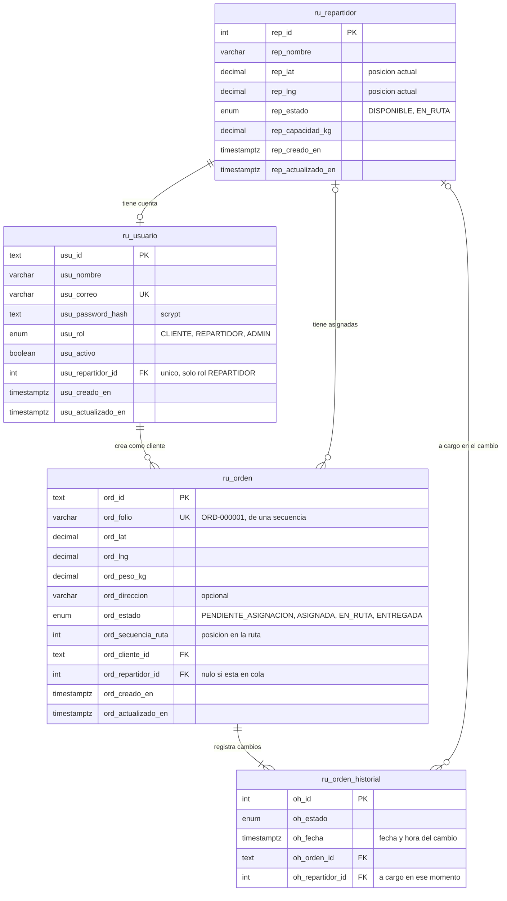

# Módulo de asignación inteligente de rutas para repartidores

Prueba técnica Fullstack. Un cliente registra una orden de entrega; el sistema la asigna al
repartidor disponible más cercano, mantiene optimizada la ruta de cada repartidor y lleva la
bitácora de cada cambio de estado.

- **Backend:** NestJS 11 + Prisma 7 + PostgreSQL 16 + Redis 7 (monorepo Nx, arquitectura hexagonal).
- **Frontend:** Angular 20 + Angular Material + Tailwind, con Storybook.
- **Infraestructura:** Docker Compose; todo el sistema levanta con un comando.

## Contenido

1. [Puesta en marcha](#1-puesta-en-marcha)
2. [Cuentas de demostración y tokens por rol](#2-cuentas-de-demostración-y-tokens-por-rol)
3. [Cómo probar cada endpoint](#3-cómo-probar-cada-endpoint)
4. [El algoritmo y sus limitaciones](#4-el-algoritmo-y-sus-limitaciones)
5. [Concurrencia](#5-concurrencia)
6. [Caché de rutas](#6-caché-de-rutas)
7. [Modelo de datos](#7-modelo-de-datos)
8. [Arquitectura](#8-arquitectura)
9. [Pruebas](#9-pruebas)
10. [Desarrollo local sin Docker](#10-desarrollo-local-sin-docker)
11. [Decisiones y supuestos](#11-decisiones-y-supuestos)
12. [Cobertura del enunciado](#12-cobertura-del-enunciado)
13. [Uso de inteligencia artificial](#13-uso-de-inteligencia-artificial)

## 1. Puesta en marcha

Requisito único: Docker con Docker Compose v2.

```bash
docker compose up --build
```

La primera vez tarda unos minutos (instala dependencias y compila). Al terminar:

| Qué                 | Dónde                                    |
| ------------------- | ---------------------------------------- |
| Aplicación web      | http://localhost:8080                    |
| API                 | http://localhost:3000/api                |
| Swagger             | http://localhost:3000/api/docs           |
| Storybook           | http://localhost:6006                    |
| Estado del servicio | http://localhost:3000/api/health         |
| PostgreSQL          | `localhost:5434`, base `almo_ruta`, esquema `rutas` |

El arranque sigue este orden: PostgreSQL y Redis → `migrator` (aplica las migraciones y siembra
3 repartidores, 5 órdenes y las cuentas de demostración; termina solo) → `backend` → `frontend`.
Las migraciones y el seed son idempotentes: se puede levantar el sistema las veces que haga falta.
Storybook es un servicio aparte que no depende de los demás: es el catálogo de componentes del
frontend ya compilado (ver [Storybook](#storybook)).

No hay que configurar nada. Si un puerto está ocupado, copiar `.env.example` a `.env` y cambiarlo
ahí (`FRONTEND_PORT`, `BACKEND_PORT`, `STORYBOOK_PORT`, `POSTGRES_PORT`).

Para volver al estado inicial (borra los datos y vuelve a sembrar):

```bash
docker compose down -v
docker compose up --build
```

## 2. Cuentas de demostración y tokens por rol

| Rol        | Correo                  | Quién es                    | Qué puede hacer                                             |
| ---------- | ----------------------- | --------------------------- | ----------------------------------------------------------- |
| CLIENTE    | `cliente@almo.test`     | Cliente Demo                | Crear órdenes y ver **sus** órdenes                         |
| REPARTIDOR | `repartidor1@almo.test` | Ana López (repartidor 1)    | Ver **su** ruta y **sus** órdenes; cambiar el estado de sus paradas |
| REPARTIDOR | `repartidor2@almo.test` | Bruno Castillo (repartidor 2) | Igual que el anterior                                     |
| REPARTIDOR | `repartidor3@almo.test` | Carla Méndez (repartidor 3) | Igual que el anterior                                       |
| ADMIN      | `admin@almo.test`       | Despacho Demo               | Solo lectura: todas las órdenes y la ruta de cualquier repartidor |

Contraseña de todas las cuentas: `Rutas2026*` (solo para evaluar la prueba).

### Generar un token

El token se obtiene con `POST /api/auth/login`; el rol depende de la cuenta con la que se entra.

```bash
# Token de CLIENTE
curl -s -X POST http://localhost:3000/api/auth/login \
  -H "Content-Type: application/json" \
  -d '{"correo":"cliente@almo.test","password":"Rutas2026*"}'

# Token de REPARTIDOR (repartidor 1)
curl -s -X POST http://localhost:3000/api/auth/login \
  -H "Content-Type: application/json" \
  -d '{"correo":"repartidor1@almo.test","password":"Rutas2026*"}'

# Token de ADMIN
curl -s -X POST http://localhost:3000/api/auth/login \
  -H "Content-Type: application/json" \
  -d '{"correo":"admin@almo.test","password":"Rutas2026*"}'
```

La respuesta trae `accessToken` (JWT HS256, válido 8 horas) y los permisos del usuario. Se envía
en cada petición como `Authorization: Bearer <accessToken>`.

Otras formas de obtenerlo:

- **Swagger:** ejecutar `POST /api/auth/login`, copiar el `accessToken` y pegarlo en **Authorize**.
- **Postman:** las peticiones de la carpeta _Autenticación_ guardan el token de cada rol en una
  variable de la colección (ver la sección siguiente).
- **Aplicación web:** la pantalla de inicio de sesión ofrece las cuentas de demostración.

### Permisos por rol

| Permiso                      | CLIENTE | REPARTIDOR | ADMIN |
| ---------------------------- | :-----: | :--------: | :---: |
| `rutas:orden:crear`          |   sí    |            |       |
| `rutas:orden:listar`         |   sí    |     sí     |  sí   |
| `rutas:orden:cambiar-estado` |         |     sí     |       |
| `rutas:ruta:leer`            |         |     sí     |  sí   |
| `rutas:repartidor:listar`    |         |            |  sí   |

Además del permiso se valida la **pertenencia del recurso**: un cliente no ve órdenes de otro
cliente y un repartidor no lee la ruta ni cambia las paradas de otro repartidor. Primero se
comprueba que el recurso exista (`404`) y después que sea del usuario (`403`).

## 3. Cómo probar cada endpoint

Tres formas equivalentes:

- **Swagger** en http://localhost:3000/api/docs: cada endpoint indica el permiso que exige.
- **Postman:** importar [`docs/postman/rutas.postman_collection.json`](docs/postman/rutas.postman_collection.json).
  Ejecutar primero la carpeta _Autenticación_; el resto de peticiones ya usa el token correcto.
- **curl**, con los ejemplos de abajo. El contrato completo, con todos los campos y errores, está
  en [`docs/contrato-api.md`](docs/contrato-api.md).

En los ejemplos, `$CLIENTE`, `$REPARTIDOR` y `$ADMIN` son los `accessToken` de la sección anterior.

### `POST /api/ordenes` — registrar una orden (CLIENTE)

```bash
curl -s -X POST http://localhost:3000/api/ordenes \
  -H "Authorization: Bearer $CLIENTE" -H "Content-Type: application/json" \
  -d '{"lat":14.605,"lng":-90.522,"peso":2.5,"direccion":"Zona 9"}'
```

Responde `201` con la orden. Si se asignó, `estado` es `ASIGNADA` y trae el repartidor y su
posición en la ruta. Si no hay repartidor disponible con capacidad, `estado` es
`PENDIENTE_ASIGNACION`: **no es un error**, la orden queda en cola y se asigna sola cuando un
repartidor se libera.

### `GET /api/ordenes?estado=&page=&limit=` — listar con filtro y paginación

```bash
curl -s "http://localhost:3000/api/ordenes?estado=ASIGNADA&page=1&limit=5" \
  -H "Authorization: Bearer $CLIENTE"
```

`estado` es opcional (`PENDIENTE_ASIGNACION`, `ASIGNADA`, `EN_RUTA`, `ENTREGADA`); `page` empieza
en 1 y `limit` va de 1 a 100 (10 por defecto). La respuesta trae `data` y `meta`
(`total`, `page`, `limit`, `totalPages`, `hasNextPage`, `hasPreviousPage`). Cada rol ve solo lo
que le corresponde: el cliente sus órdenes, el repartidor las suyas y el admin todas.

### `GET /api/ordenes/{folio}` — detalle con historial

```bash
curl -s http://localhost:3000/api/ordenes/ORD-000003 -H "Authorization: Bearer $CLIENTE"
```

`historial` trae la fecha y hora de cada cambio de estado, en orden cronológico.

### `GET /api/repartidores/{id}/ruta` — ruta optimizada (REPARTIDOR o ADMIN)

```bash
curl -s http://localhost:3000/api/repartidores/1/ruta -H "Authorization: Bearer $REPARTIDOR"
```

Devuelve las paradas pendientes en el orden optimizado, con la distancia desde la parada anterior
(`distanciaDesdeAnteriorKm`), la acumulada y la total de la ruta.

### `PATCH /api/ordenes/{folio}/estado` — cambiar el estado (REPARTIDOR)

```bash
# El repartidor sale a ruta: todas sus órdenes ASIGNADA pasan a EN_RUTA
curl -s -X PATCH http://localhost:3000/api/ordenes/ORD-000003/estado \
  -H "Authorization: Bearer $REPARTIDOR" -H "Content-Type: application/json" \
  -d '{"estado":"EN_RUTA"}'

# Entrega una parada
curl -s -X PATCH http://localhost:3000/api/ordenes/ORD-000003/estado \
  -H "Authorization: Bearer $REPARTIDOR" -H "Content-Type: application/json" \
  -d '{"estado":"ENTREGADA"}'
```

### `GET /api/repartidores` — tablero de despacho (ADMIN)

```bash
curl -s http://localhost:3000/api/repartidores -H "Authorization: Bearer $ADMIN"
```

### Errores

Todos los errores tienen la misma forma y un mensaje pensado para mostrarse al usuario
(en español, o en inglés con `Accept-Language: en`):

```json
{
  "statusCode": 404,
  "code": "RUTAS.ORDEN_NO_ENCONTRADA",
  "message": "No existe una orden con el folio ORD-999999.",
  "timestamp": "2026-09-30T18:00:00.000Z"
}
```

| HTTP | `code`                             | Cuándo                                                  |
| ---- | ---------------------------------- | ------------------------------------------------------- |
| 400  | `VALIDACION.ENTRADA_INVALIDA`      | Campos faltantes, no numéricos o fuera de rango (trae `details` por campo) |
| 401  | `AUTH.CREDENCIALES_INVALIDAS`      | Correo o contraseña incorrectos                         |
| 401  | `AUTH.NO_AUTENTICADO`              | Falta el token, está mal formado o expiró               |
| 403  | `AUTH.PERMISO_DENEGADO`            | El rol no tiene el permiso del endpoint                 |
| 403  | `AUTH.RECURSO_AJENO`               | El recurso existe pero pertenece a otro usuario         |
| 404  | `RUTAS.ORDEN_NO_ENCONTRADA`        | El folio no existe                                      |
| 404  | `RUTAS.REPARTIDOR_NO_ENCONTRADO`   | El id de repartidor no existe                           |
| 409  | `RUTAS.TRANSICION_ESTADO_INVALIDA` | El cambio de estado no es válido desde el estado actual |

## 4. El algoritmo y sus limitaciones

### Asignación de una orden

1. Se toman los repartidores **disponibles** a los que todavía les cabe el peso de la orden
   (capacidad menos la carga de sus paradas pendientes).
2. Se calcula la distancia de Haversine entre la posición actual de cada uno y el destino.
3. Gana el más cercano. Si hay empate, el que tiene menos paradas pendientes y, si persiste,
   el de menor id: el resultado es siempre determinista.
4. Si no hay ninguno, la orden queda `PENDIENTE_ASIGNACION` en una cola. Cuando un repartidor
   termina su ruta vuelve a estar disponible y la cola se reparte en orden de llegada (FIFO);
   una orden que no cabe se salta y sigue esperando, sin bloquear a las que vienen detrás.

**Haversine** da la distancia sobre la superficie de una esfera (radio medio terrestre de
6371.0088 km) entre dos pares latitud/longitud:

```
a = sin²(Δlat/2) + cos(lat₁) · cos(lat₂) · sin²(Δlng/2)
d = 2 · R · atan2(√a, √(1−a))
```

### Optimización de la ruta

Cada vez que a un repartidor se le asigna una orden o entrega una parada, su ruta se recalcula:

1. **Vecino más cercano:** partiendo de la posición actual del repartidor, se visita siempre la
   parada pendiente más cercana a la última visitada. Costo O(n²).
2. **Mejora 2-opt:** sobre ese recorrido se prueban inversiones de tramos y se conservan las que
   acortan la distancia total, hasta que ninguna mejora. Corrige los cruces típicos del vecino
   más cercano.

La ruta es un camino abierto (no vuelve al punto de partida) y el orden resultante se guarda en
la orden (`secuenciaRuta`), así que consultar la ruta no vuelve a optimizar.

### Limitaciones

- **Distancia en línea recta.** Haversine ignora calles, sentidos, tráfico y relieve. En una
  ciudad la distancia real por carretera es mayor y el repartidor "más cercano" puede no ser el
  que llega antes. Para producción se sustituiría por una matriz de distancias de un motor de
  rutas; el cálculo está aislado en un servicio de dominio precisamente para poder cambiarlo.
- **La ruta no es óptima.** El problema es el del viajante (NP-difícil). Vecino más cercano más
  2-opt da buenas rutas en tiempo razonable, pero puede quedarse en un óptimo local; hay una
  prueba unitaria que documenta un caso donde ocurre.
- **La asignación es voraz.** Cada orden se decide en el momento en que llega, sin reconsiderar
  las ya asignadas. Un reparto global (por lotes) podría ser mejor, a cambio de más complejidad.
- **Solo distancia y peso.** No hay ventanas de horario, prioridades, volumen ni tiempos de
  servicio por parada.
- **La posición del repartidor no es en vivo.** Se actualiza al destino de cada parada entregada.

## 5. Concurrencia

Dos órdenes que llegan a la vez no pueden asignarse sobre la misma lectura de la carga de un
repartidor, o se superaría su capacidad.

Toda operación de despacho (crear una orden, salir a ruta, entregar) corre en una transacción
que empieza tomando un **bloqueo consultivo transaccional de PostgreSQL**
(`pg_advisory_xact_lock`). Las operaciones quedan en fila: cada una lee el estado que dejó la
anterior y el bloqueo se libera solo al confirmar o revertir. Al haber un único bloqueo y
tomarse siempre primero, no hay interbloqueos posibles.

Se eligió sobre `SELECT … FOR UPDATE` porque la asignación lee a **todos** los repartidores
disponibles para compararlos: bloquear filas sueltas dejaría ventanas entre lecturas. El costo es
que el despacho se procesa de uno en uno, suficiente para este volumen; con más carga se
particionaría el bloqueo por zona.

El folio (`ORD-000001`) sale de una secuencia de la base, así que es único aunque lleguen
órdenes en paralelo.

Está verificado en las pruebas: una unitaria con una contraprueba que demuestra que sin el
bloqueo se sobreasigna, y una e2e contra PostgreSQL real que lanza 30 órdenes simultáneas y
comprueba que ningún repartidor supera su capacidad, que no hay folios repetidos y que las
secuencias de cada ruta no tienen huecos.

## 6. Caché de rutas

La ruta calculada de cada repartidor se guarda en Redis (`rutas:ruta:repartidor:<id>`) con un
tiempo de vida de 5 minutos (`CACHE_TTL_RUTA_SECONDS`).

- Se **invalida** cada vez que cambia la ruta de ese repartidor: una orden nueva asignada, la
  salida a ruta o una entrega. La invalidación ocurre **después** de confirmar la transacción,
  para que nadie vuelva a cachear datos que todavía pueden revertirse.
- Si Redis no responde, se trata como un fallo de caché: la ruta se calcula desde la base y el
  servicio sigue funcionando.

## 7. Modelo de datos

Base `almo_ruta`, esquema `rutas`.



- **`ru_orden_historial`** es la bitácora: una fila por cambio de estado, nunca se actualiza.
  De ahí sale la fecha y hora de cada transición.
- **Reglas en la base**, además de en el código: restricciones `CHECK` para rangos de latitud y
  longitud, peso y capacidad positivos, y para que una orden tenga repartidor si y solo si no
  está en cola.
- **Índices** para los caminos frecuentes: `(ord_estado, ord_creado_en)` para el listado filtrado
  y la cola FIFO, `(ord_repartidor_id, ord_estado)` para las paradas y la carga de un repartidor,
  `(ord_cliente_id, ord_creado_en)` para las órdenes de un cliente.
- **Nomenclatura** uniforme en snake_case: tablas `ru_<nombre>`, columnas con el prefijo de su
  tabla (`rep_`, `usu_`, `ord_`, `oh_`), y `pk_`, `fk_`, `uq_`, `idx_`, `ck_` para restricciones
  e índices. Fechas en `TIMESTAMPTZ` (UTC).

El esquema está en [`backend/libs/prisma/src/lib/schema/rutas.prisma`](backend/libs/prisma/src/lib/schema/rutas.prisma)
y la migración SQL junto a él, en `migrations/`.

## 8. Arquitectura

```
├── backend/                 Monorepo Nx
│   ├── apps/rutas/          Servicio HTTP (NestJS)
│   ├── apps/rutas-e2e/      Pruebas e2e contra PostgreSQL y Redis reales
│   └── libs/                result · exceptions · security · prisma · transactions · redis · health
├── frontend/                Aplicación Angular + Storybook
├── infra/                   docker-compose.dev.yml (solo PostgreSQL y Redis, para desarrollar)
├── docs/                    Contrato de la API y colección de Postman
└── docker-compose.yml       Todo el sistema
```

### Backend: hexagonal, organizado por funcionalidad

```
apps/rutas/src/
├── ordenes/ · repartidores/ · autenticacion/ · shared/
│   ├── domain/           Entidades, value objects, servicios y puertos. TypeScript puro.
│   ├── application/      Casos de uso: orquestan el dominio a través de los puertos.
│   └── infrastructure/   Adaptadores: controllers HTTP, Prisma, Redis, JWT.
```

- El **dominio** no conoce NestJS, Prisma ni Redis: Haversine, la elección de repartidor y el
  optimizador de rutas son funciones puras y se prueban sin infraestructura. Una regla de ESLint
  impide que `domain/` o `application/` importen de `infrastructure/`.
- Los **puertos** son clases abstractas que hacen de token de inyección; cambiar PostgreSQL o
  Redis por otra tecnología es escribir otro adaptador.
- Los errores de negocio viajan como valores (`Result<T, E>`), no como excepciones; un
  interceptor y un filtro globales los convierten en la respuesta HTTP con su código y mensaje.

### Frontend

Módulos `Auth`, `Ordenes`, `Repartidores` y `Shared`, cada uno con `Domain`, `Application` e
`Infrastructure`. Componentes standalone con signals. Pantallas:

| Ruta             | Rol        | Qué hace                                                        |
| ---------------- | ---------- | --------------------------------------------------------------- |
| `/login`         | —          | Inicio de sesión                                                |
| `/ordenes/nueva` | CLIENTE    | Formulario de orden: zona de una lista o coordenadas, y peso    |
| `/ordenes`       | Todos      | Lista de órdenes con filtro por estado y paginación             |
| `/mi-ruta`       | REPARTIDOR | Paradas en orden, con la distancia entre cada una               |
| `/despacho`      | ADMIN      | Repartidores, su carga y la ruta de cada uno                    |

El menú y las rutas se arman a partir de los permisos del token; el diseño es adaptable a móvil.

### Storybook

Los componentes del frontend se desarrollaron y se revisan aislados en Storybook, disponible en
http://localhost:6006 al levantar el sistema.

- **115 historias de 28 componentes**, agrupadas por módulo (`Shared`, `Auth`, `Ordenes`,
  `Repartidores`). Cada historia vive junto a su componente (`*.stories.ts`).
- Cada componente tiene una historia por estado o variante: cargando, vacío, error de conexión,
  errores de validación, cada estado de una orden y la vista en móvil.
- Las **pantallas completas** también tienen historias, montadas con repositorios simulados, así
  que se pueden recorrer sin backend. Por ejemplo, en `Repartidores/MiRutaPage` se puede iniciar
  la ruta y entregar cada parada.
- El panel de accesibilidad (`addon-a11y`) audita cada historia con axe-core.

En desarrollo se arranca con recarga en caliente con `pnpm storybook` (sección 10).

## 9. Pruebas

```bash
cd backend
pnpm test             # unitarias + integración HTTP (no necesitan base de datos)
pnpm test:coverage    # con cobertura
pnpm lint
```

- **Unitarias:** Haversine, value objects, elección de repartidor, optimizador de rutas, máquina
  de estados y cada caso de uso, con dobles en memoria.
- **Integración HTTP:** el servicio completo en el mismo proceso (controllers, guards, validación,
  filtro de errores) con persistencia en memoria.
- **e2e:** contra el servicio, PostgreSQL y Redis reales, incluida la ráfaga de 30 órdenes
  simultáneas. Necesita la infraestructura de desarrollo (sección 10) y **vacía la base**, por
  eso exige confirmación explícita:

  ```bash
  cd backend
  E2E_CONFIRM_TRUNCATE=true pnpm e2e      # en PowerShell: $env:E2E_CONFIRM_TRUNCATE='true'; pnpm e2e
  ```

Resultado actual del backend: 322 pruebas unitarias y de integración y 20 e2e, todas en verde.
Cobertura del servicio `rutas`: 95 % de sentencias, 83 % de ramas y 100 % de funciones.

```bash
cd frontend
pnpm test:ci              # unitarias (Karma + Jasmine, Chrome sin interfaz)
pnpm lint
pnpm check:architecture   # las capas no se importan en el sentido equivocado
```

Resultado actual del frontend: 212 pruebas en verde, con 99 % de sentencias y 94 % de ramas
cubiertas en los archivos que tienen pruebas (los archivos de composición, como `app.config.ts`,
no se miden).

## 10. Desarrollo local sin Docker

Requisitos: Node 22, pnpm 10 y Docker (solo para PostgreSQL y Redis).

```bash
# Backend → http://localhost:3000/api
cd backend
cp .env.example .env
pnpm install
pnpm docker:dev               # PostgreSQL en :5434 y Redis en :6380
pnpm prisma:migrate:deploy
pnpm prisma:seed
pnpm start
```

```bash
# Frontend → http://localhost:4200 (reenvía /api al backend)
cd frontend
pnpm install
pnpm start
pnpm storybook                # catálogo de componentes en http://localhost:6006
```

`pnpm docker:dev` y `docker compose up` publican PostgreSQL en el mismo puerto: usar uno u otro.

## 11. Decisiones y supuestos

El enunciado deja varios puntos abiertos. Así se resolvieron:

- **Qué significa "disponible".** Un repartidor está `DISPONIBLE` mientras junta órdenes y
  `EN_RUTA` desde que sale. Solo los disponibles reciben órdenes nuevas; por eso un repartidor
  puede tener varias paradas y la optimización de ruta tiene sentido.
- **El peso es capacidad.** Cada repartidor tiene una capacidad en kilogramos y una orden solo se
  le asigna si le cabe. Una orden admite hasta 50 kg.
- **Salir a ruta es un evento del repartidor.** Marcar `EN_RUTA` una de sus órdenes pasa a
  `EN_RUTA` todas las que tiene asignadas. Entregar una parada sin haber salido registra la
  salida en ese mismo momento.
- **La posición se actualiza al entregar.** El repartidor queda en el destino de la última parada
  entregada, y desde ahí se calculan las distancias siguientes.
- **La cola se vacía sola.** Al entregar su última parada el repartidor vuelve a estar disponible
  y recibe las órdenes pendientes que le quepan, en orden de llegada.
- **Un tercer rol de solo lectura (`ADMIN`).** El enunciado pide al menos dos; despacho necesita
  ver todas las órdenes y rutas sin poder modificarlas.
- **PostgreSQL.** Se eligió por los bloqueos consultivos transaccionales, que resuelven la
  concurrencia de la asignación con una sola instrucción, y por las restricciones `CHECK`, los
  tipos enumerados y las secuencias con las que la base valida las reglas por sí misma. El
  acceso a datos está detrás de puertos, así que migrar a otro motor relacional se limita a los
  adaptadores de persistencia y a la migración.
- **Contraseñas con scrypt** (módulo `crypto` de Node), con una sal por cuenta. Los secretos y
  credenciales del repositorio son de demostración y se pueden sustituir por variables de entorno.

## 12. Cobertura del enunciado

| Requisito                                               | Dónde                                                        |
| ------------------------------------------------------- | ------------------------------------------------------------ |
| `POST /api/ordenes` con asignación automática           | `ordenes/application/use-cases/crear-orden`                  |
| Repartidor disponible más cercano (Haversine)           | `shared/domain/services/distancia-haversine.service.ts`, `ordenes/domain/services/asignador-ordenes.service.ts` |
| Cola "Pendiente de Asignación" sin devolver error       | `ordenes/application/services/despacho.service.ts`           |
| `GET /api/repartidores/{id}/ruta` con paradas optimizadas | `repartidores/domain/services/optimizador-ruta.service.ts` |
| `GET /api/ordenes?estado=&page=&limit=`                 | `ordenes/application/use-cases/listar-ordenes`               |
| `PATCH /api/ordenes/{folio}/estado`                     | `ordenes/application/use-cases/iniciar-ruta` y `entregar-orden` |
| Cuatro estados con fecha y hora de cada cambio          | Tabla `ru_orden_historial`                                   |
| JWT con dos roles y permisos distintos                  | `libs/security` (guards, permisos por rol, pertenencia)      |
| Asignación segura ante peticiones simultáneas           | Sección 5                                                    |
| `404` con mensaje amigable                              | `libs/exceptions` (filtro global, mensajes en español e inglés) |
| Datos precargados: 3 repartidores y 5 órdenes           | `backend/libs/prisma/src/lib/seed`                           |
| Formulario de orden, vista de ruta y lista con filtro   | `frontend/` (sección 8), con cada componente en Storybook    |
| Validación de entradas                                  | DTOs con `class-validator` y value objects del dominio       |
| Docker Compose con un comando                           | `docker-compose.yml`                                         |
| Arquitectura por capas                                  | Sección 8                                                    |
| Pruebas unitarias de Haversine y de la optimización     | `*.spec.ts` junto a cada servicio de dominio                 |
| Caché de la ruta con invalidación                       | Sección 6                                                    |
| Documentación de la API                                 | Swagger en `/api/docs` y colección de Postman en `docs/postman` |
| Diagrama del modelo de datos                            | Sección 7                                                    |

## 13. Uso de inteligencia artificial

Este proyecto se desarrolló con **Claude Code**, el agente de programación de Anthropic (modelo
Claude Opus), y los commits lo indican con la línea `Co-Authored-By`.

**Para qué se usó:** generar el código del backend y del frontend, las pruebas, la configuración
de Docker y esta documentación, a partir del enunciado y de las decisiones del autor.

**Por qué:** permite cubrir en el tiempo de la prueba un alcance que normalmente se recorta
(pruebas e2e contra servicios reales, la prueba de concurrencia, Storybook, Docker), y dedicar
el tiempo propio a decidir y a revisar en lugar de a escribir código repetitivo.

**Qué decidió el autor:** el stack, la arquitectura hexagonal y la estructura de carpetas, la
convención de nombres de la base de datos, un único repositorio para todo el sistema y el
criterio de avanzar con commits pequeños que muestran el proceso.

**Cómo se verificó lo generado:** nada se dio por bueno sin ejecutarlo. El backend y el frontend
pasan lint, sus pruebas y la compilación; el flujo completo, los permisos y la concurrencia se
comprueban con pruebas e2e contra PostgreSQL y Redis reales, y el sistema se levantó con
`docker compose up` y se recorrió en el navegador con los tres roles.
